# Buildone

> 개발자를 위한 할 일 목록 관리 서비스  
> 개발 기간: 2025.01.23 ~ 2025.03.18 (약 8주)

## 팀 구성 및 역할

| 이름    | 담당 업무 |
|---------|----------|
| 김강우  | - 대시보드 페이지<br>- Modal, Sheet, Popup 컴포넌트 개발<br>- 할 일 생성/수정 기능 구현<br>- 크롬 익스텐션 개발 |
| 곽태근  | - 모든 할 일 목록, 랜딩 페이지<br>- 내비게이션 바, Todo 컴포넌트 개발 및 노트 링크 임베드 기능 구현<br>- Sentry, Jest 테스트 환경 구축 |
| 유하임  | - 노트 모아보기, 노트 작성 페이지<br>- Dropdown, TapMenu, Chip, Filter, Counting 컴포넌트 개발<br>- 스트릭 보드, 태그 기능 구현 |
| 채유빈  | - 로그인/회원가입, 목표 상세 페이지<br>- Input, Button, Progress Bar 컴포넌트 개발<br>- 웹 푸시 알림, 프로필 카드 저장 기능 구현 |


## 기능

|🚨웹 푸시 알림 (거북목 주의보)🚨|
|:---:|
|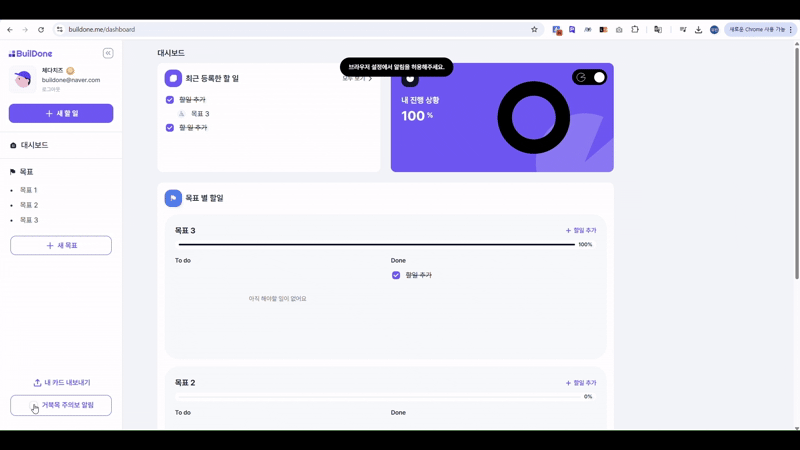|
|06:00 ~ 24:00 매시 정각 스트레칭 알림 발송
FCM을 활용하여 여러 플랫폼에서 일관된 푸시 알림 기능 제공
앱 상태(포그라운드/백그라운드)에 따라 적절한 방식으로 푸시 알림 창 노출|

|⚒️크롬 익스텐션⚒️|
|:---:|
|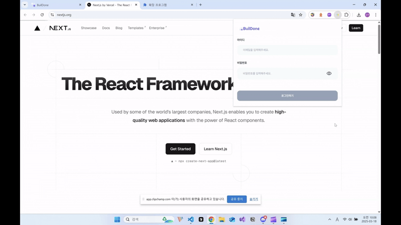|
|익스텐션으로 링크를 첨부한 할 일 생성 지원
한 번 로그인하면 브라우저를 닫을 때까지 인증 유지|

|🔒회원가입/로그인(인증) 기능🔒|
|:---:|
|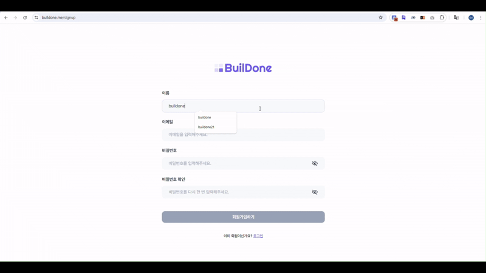|
|Next.js Middleware, Server Action, Axios Interceptor로 인증 처리 
중복 코드 최소화, 글로벌 에러 처리 및 토큰 만료 시 자동 로그인 연장
react-hook-form과 zod를 사용하여 다양한 시점의 유효성 검사 기능 구현, <br> 불필요한 리렌더링 최소화 및 타입 안정성 보장|

|🔍내비게이션 사이드바🔍|
|:---:|
|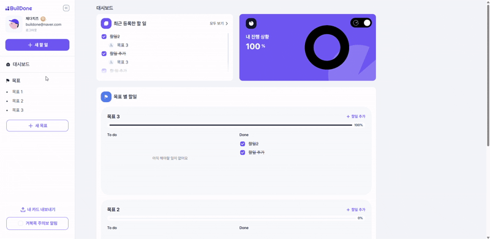|
|서비스 내 다양한 페이지 탐색 가능
cva를 활용하여 반응형 디자인 및 열림/닫힘 상태 구현|

|💻대시보드 페이지💻|
|:---:|
|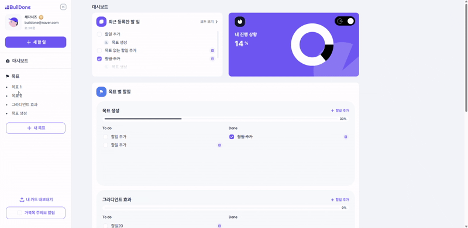|
|스트릭 보드 및 통계 기능으로 학습 진행 상황 시각화
React Suspense와 Tanstack Query의 useSuspenseQuery를 사용한 로딩 최적화로 <br> 사용자 경험 개선
prefetchQuery를 사용하여 렌더링 지연 시간 단축|

|📖모든 할 일 및 목표별 할 일 페이지📖|
|:---:|
|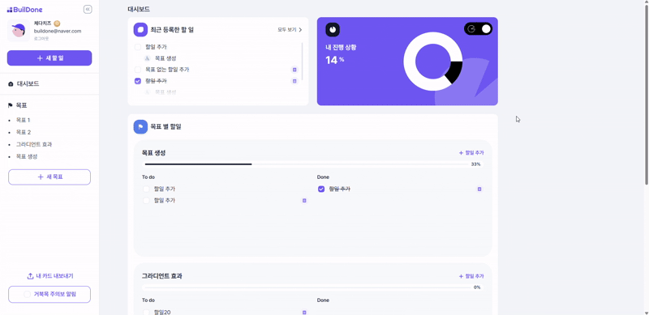|
|할 일 상태별 필터링 제공 및 무한 스크롤 지원
Intersection Observer를 활용하여 성능 최적화|

|✅목표 및 할 일 생성, 수정, 삭제 기능✅|
|:---:|
|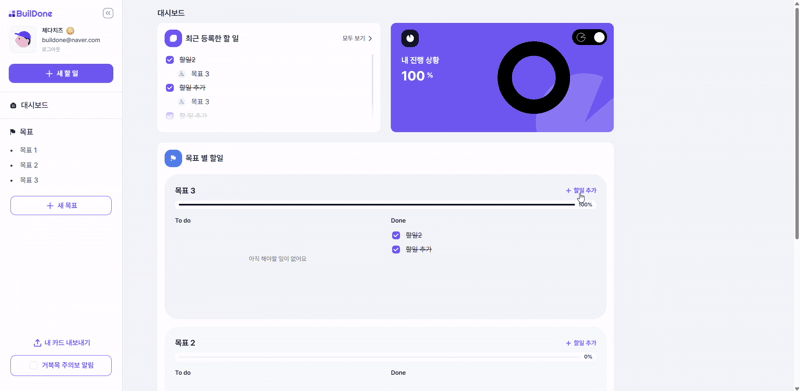|
|내비게이션 사이드 바에서 목표 생성 가능
할 일 생성 시 파일, 링크 첨부 가능
생성, 수정, 삭제 성공/실패 시 토스트 메시지로 사용자에게 적절한 피드백 제공|

|📒노트 작성 및 수정 기능📒|
|:---:|
|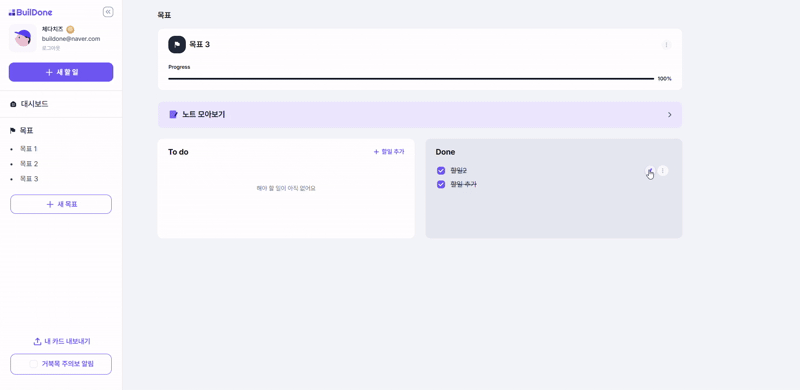|
|할일에 대한 노트 작성 및 수정 지원
TipTp 기반의 리치 텍스트 에디터 제공
개발자 친화적인 마크다운 변환 기능 및 커스텀 툴바 적용|

|💾노트 임시 저장 기능💾|
|:---:|
|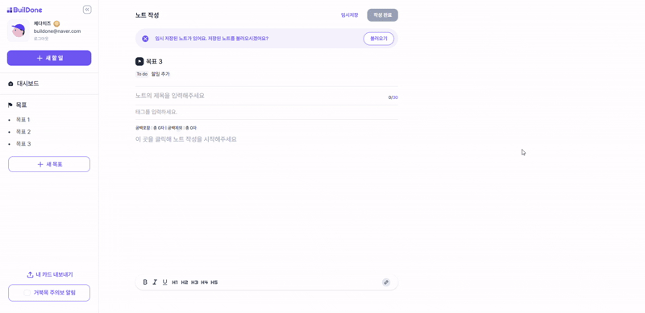|
|로컬 스토리지를 활용한 임시 저장 기능 제공
useCallback을 활용하여 임시 저장 로직 메모이제이션, 성능 최적화|

|🔗노트 링크 임베드 기능🔗|
|:---:|
|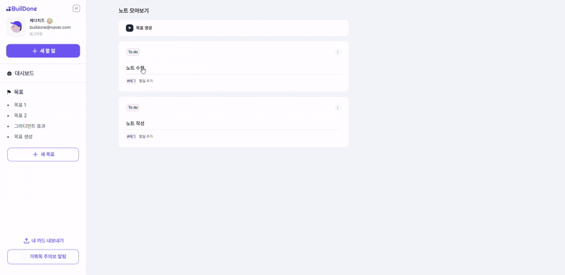|
|노트에 첨부된 링크 클릭 시 링크 콘텐츠 임베드 뷰 제공
임베드 불가능한 경우 바로가기 버튼으로 일관된 사용자 경험 유지|

|🃏프로필 카드 생성&저장 기능🃏|
|:---:|
|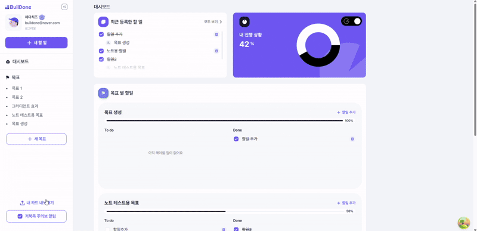|
|motion을 활용한 카드 플립 애니메이션 효과 적용
scale 조정으로 보다 선명한 화질로 이미지 저장|

## 설치 및 실행 방법

```
node version: v22.14.0
npm version: v10.9.2
```

1. 레포지토리를 클론합니다.

```shell
git clone https://github.com/codeit-si/buildone-client.git

cd buildone-client
```

2. `buildone-client` 디렉토리의 최상위에 `.env.local` 파일 생성 후 아래와 같이 작성합니다.

```
NEXT_PUBLIC_SERVER_ADDRESS=http://localhost:3000
```

3. 터미널에서 아래 명령어를 차례대로 입력합니다.

```shell
npm install
npm run dev
```

4. 브라우저에서 http://localhost:3000 페이지에 접속합니다.

## 배포 주소

https://buildone.me

## 기술 스택

- 프레임워크 & 언어:  
- 스타일링: 
- 코드 품질 관리:   
- 데이터 요청 & 상태 관리:  
- 유효성 검사 & 폼 관리:  
- API 통신: 
- 푸시 알림: 
- 테스트 & 모니터링:  
- 텍스트 편집기: 
- 배포: 

## 프로젝트 구조

```yaml
.
├── .husky
├── public
└── src
    ├── app  # 라우팅 관련 파일
    │   ├── (auth)  # 인증 관련(로그인, 회원가입) 페이지
    │   ├── (main)  # 메인 서비스 페이지
    │   ├── api  # api route handler
    ├── assets  # svg 파일 (svgr 활용)
    ├── components
    │   ├── @common  # 공용 UI 컴포넌트
    │   ├──  # 각 도메인, 페이지 별 필요한 컴포넌트 
    ├── constants  # 상수
    ├── hooks  # 커스텀 훅
    ├── lib  # 외부 라이브러리 관련 파일
    ├── services  # API 요청 관련 파일
    │   └── query-key.ts  # 쿼리 키 관리 파일
    ├── store  # Zustand store 관리 파일
    ├── styles
    ├── types
    └── utils
```